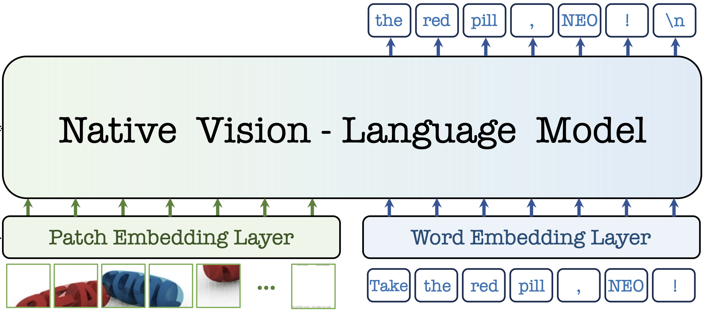
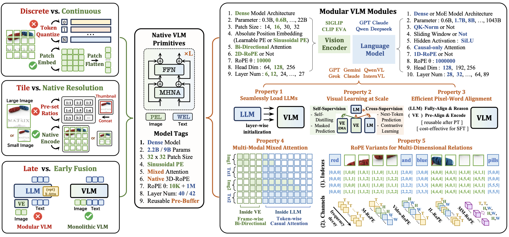

# <p align="center">  NEO Series: Native Vision-Language Models </p>

<p align="center">
  
</p>

- **2025/09**: [From Pixels to Words -- Towards Native Vision-Language Primitives at Scale](https://arxiv.org/abs/2510.14979) (arXiv 2025)


## 📜 News   
[2025/10] The [paper](https://arxiv.org/abs/2510.14979), [weights](https://huggingface.co/collections/Paranioar/neo1-0-68f0db9cbac952be3eca7089), and [test code](https://github.com/EvolvingLMMs-Lab/NEO/blob/main/VLMEvalKit/README.md) of **NEO** are released !     
[2025/09] 💥💥💥 **NEO** has been completed !  


## 💡 Motivation

<p align="center">
  
</p>

- **What constraints set native VLMs apart from modular ones, and to what extent can they be overcome?**

- **How to make native VLMs more accessible and democratized, thereby accelerating their progress?**   

## 💡 Highlights

- 🔥 **Native Architecture:** NEO innovates a native VLM primitive  that unifies pixel-word encoding, alignment, and reasoning within a dense, monolithic model architecture. 

- 🔥 **Superior Efficiency:** With merely 390M image-text examples, NEO develops strong visual perception from scratch, rivaling top-tier modular VLMs and outperforming native ones.  

- 🔥 **Promising Roadmap:** NEO pioneers a promising route for scalable and powerful native VLMs, paired with diverse reusable components that foster a cost-effective and extensible ecosystem.

## 🤖 Model Zoo

We release 2B and 9B **NEO** in Pre-Training (PT), Mid-Training (MT), and Supervised Fine-Tuning (SFT). 

| Model Name | Model Weight|
| ---------- | ------------------------------------------------------- |
| **NEO-2B-PT**    | [🤗 NEO-2B-PT HF link](https://huggingface.co/Paranioar/NEO1_0-2B-PT) |
| **NEO-2B-MT**    | [🤗 NEO-2B-MT HF link](https://huggingface.co/Paranioar/NEO1_0-2B-MT) |
| **NEO-2B-SFT**   | [🤗 NEO-2B-SFT HF link](https://huggingface.co/Paranioar/NEO1_0-2B-SFT) |
| **NEO-9B-PT**    | [🤗 NEO-9B-PT HF link](https://huggingface.co/Paranioar/NEO1_0-9B-PT) |
| **NEO-9B-MT**    | [🤗 NEO-9B-MT HF link](https://huggingface.co/Paranioar/NEO1_0-9B-MT) |
| **NEO-9B-SFT**   | [🤗 NEO-9B-SFT HF link](https://huggingface.co/Paranioar/NEO1_0-9B-SFT) |


## 📊 Benchmark Results

> **TABLE NOTE:**  
> - “# Data” = data scale for pre-training / mid-training / supervised fine-tuning.  
> - “†“ = vision-language models using Reinforcement Learning (RL).  
> - “Any Res.” = any resolution; “Tile-wise” = image split into tiles; <br> “Any Rat.” = any aspect ratio; “Fix Res.” = fixed resolution.  
> - “MoE“ = Mixture-of-Experts; “DaC“ = Divide-and-Conquer.  
> - **Bold** = best score in each column. <br><br>


| **Model_NAME** | **Base_LLM_NAME** | **#Data_PT·MT·SFT** | **Input_TYPE** | **RoPE_TYPE** | **MMMU** | **MMB** | **MMVet** | **MMStar** | **SEED_I** | **POPE** | **HallB** | **AI2D** | **DocVQA** | **ChartQA** | **InfoVQA** | **TextVQA** | **OCRBench** |
|:--|:--|:--|:--|:--|:--:|:--:|:--:|:--:|:--:|:--:|:--:|:--:|:--:|:--:|:--:|:--:|:--:|
| 🔻**Modular_VLMs_(2B)** |||||||||||||||||||
| Qwen2-VL | Qwen2-1.5B | --·--·-- | Any Res. | M-RoPE | 41.1 | 74.9 | 49.5 | 48.0 | -- | -- | 41.7 | 74.7 | 90.1 | 73.5 | 65.5 | **79.7** | 80.9 |
| InternVL2.5 | InternLM2.5-1.8B | >6B·100M·16M | Tile-wise | 1D-RoPE | 43.6 | 74.7 | 60.8 | 53.7 | -- | **90.6** | 42.6 | 74.9 | 88.7 | 79.2 | 60.9 | 74.3 | 80.4 |
| Qwen2.5-VL† | Qwen2.5-1.5B | --·--·-- | Any Res. | M-RoPE | **51.2** | 79.1 | 61.8 | 55.9 | -- | -- | **46.3** | **81.6** | **93.9** | **84.0** | **77.1** | 79.3 | 79.7 |
| InternVL3† | Qwen2.5-1.5B | >6B·100M·22M | Tile-wise | 1D-RoPE | 48.6 | **81.1** | **62.2** | **60.7** | -- | 89.6 | 42.5 | 78.7 | 88.3 | 80.2 | 66.1 | 77.0 | **83.5** |
| Encoder_Based | Qwen3-1.7B | >6B·40M·4M | Tile-wise | 1D-RoPE | 47.1 | 75.8 | 37.4 | 52.7 | **73.6** | 87.0 | 44.4 | 77.4 | 89.9 | 78.4 | 65.9 | 73.3 | **83.5** |
| 🔻**Native_VLMs_(2B)** |||||||||||||||||||
| Mono-InternVL | InternLM2-1.8B | 1.2B·143M·7M | Tile-wise | 1D-RoPE | 33.7 | 65.5 | 40.1 | -- | 67.4 | -- | 34.8 | 68.6 | 80.0 | 73.7 | 43.0 | 72.6 | 76.7 |
| Mono-InternVL-1.5 | InternLM2-1.8B | 400M·150M·7M | Tile-wise | 1D-RoPE | 39.1 | 64.0 | **54.0** | -- | 66.9 | -- | 32.5 | 67.4 | 81.7 | 72.2 | 47.9 | 73.7 | **80.1** |
| HoVLE | InternLM2-1.8B | 550M·50M·7M | Tile-wise | 1D-RoPE | 32.2 | 73.3 | 43.8 | -- | 70.9 | 87.4 | 38.4 | 73.0 | 86.1 | 78.6 | 55.7 | 70.9 | 74.0 |
| OneCAT | Qwen2.5-1.5B | 436M·70M·13M | Any Res. | M-RoPE | 39.0 | 72.4 | 42.4 | -- | 70.9 | -- | -- | 72.4 | 87.1 | 76.2 | 56.3 | 67.0 | -- |
| **NEO** | Qwen3-1.7B | 345M·40M·4M | Any Res. | Native_RoPE | **48.6** | **76.0** | 49.6 | **54.2** | **74.2** | **87.5** | **43.1** | **80.1** | **89.9** | **81.2** | **63.2** | **74.0** | 77.1 |
| 🔻**Modular_VLMs_(8B)** |||||||||||||||||||
| Qwen2-VL | Qwen2-7B | --·--·-- | Any Res. | M-RoPE | 54.1 | 83.0 | 62.0 | 60.7 | -- | 88.1 | 50.6 | 83.0 | 94.5 | 83.0 | 76.5 | 84.3 | 86.6 |
| InternVL2.5 | InternLM2.5-7B | >6B·50M·4M | Tile-wise | 1D-RoPE | 56.0 | **84.6** | 62.8 | 64.4 | -- | 90.6 | 50.1 | 84.5 | 93.0 | 84.8 | 77.6 | 79.1 | 82.2 |
| Qwen2.5-VL† | Qwen2.5-7B | --·--·-- | Any Res. | M-RoPE | 55.0 | 83.5 | 67.1 | 63.9 | -- | 86.4 | **52.9** | 83.9 | **95.7** | **87.3** | **82.6** | **84.9** | 86.4 |
| InternVL3† | Qwen2.5-7B | >6B·100M·22M | Tile-wise | 1D-RoPE | **62.7** | 83.4 | **81.3** | **68.2** | -- | **91.1** | 49.9 | **85.2** | 92.7 | 86.6 | 76.8 | 80.2 | **88.0** |
| Encoder-Based | Qwen3-8B | >6B·40M·4M | Tile-wise | 1D-RoPE | 54.1 | 84.0 | 60.0 | 63.5 | **76.2** | 87.8 | 51.4 | 82.9 | 92.1 | 83.5 | 75.0 | 77.1 | 85.3 |
| 🔻**Native_VLMs_(8B)** |||||||||||||||||||
| Fuyu | Persimmon-8B | --·--·-- | Any Res. | 1D-RoPE | 27.9 | 10.7 | 21.4 | -- | 59.3 | 84.0 | -- | 64.5 | -- | -- | -- | -- | 36.6 |
| Chameleon | from scratch | 1.4B·0M·1.8M | Fix Res. | 1D-RoPE | 25.4 | 31.1 | 8.3 | -- | 30.6 | 19.4 | 17.1 | 46.0 | 1.5 | 2.9 | 5.0 | 4.8 | 0.7 |
| EVE | Vicuna-7B | 33M·0M·1.8M | Any Rat. | 1D-RoPE | 32.6 | 52.3 | 25.7 | -- | 64.6 | 85.0 | 26.4 | 61.0 | 53.0 | 59.1 | 25.0 | 56.8 | 39.8 |
| SOLO | Mistral-7B | 44M·0M·2M | Any Res. | 1D-RoPE | -- | 67.7 | 30.4 | -- | 64.4 | 78.6 | -- | 61.4 | -- | -- | -- | -- | 12.6 |
| Emu3 | from scratch | --·--·-- | Fix Res. | 1D-RoPE | 31.6 | 58.5 | 37.2 | -- | 68.2 | 85.2 | -- | 70.0 | 76.3 | 68.6 | 43.8 | 64.7 | 68.7 |
| EVEv2 | Qwen2.5-7B | 77M·15M·7M | Any Rat. | 1D-RoPE | 39.3 | 66.3 | 45.0 | -- | 71.4 | 87.6 | -- | 74.8 | -- | 73.9 | -- | 71.1 | 70.2 |
| BREEN | Qwen2.5-7B | 13M·0M·4M | Any Res. | 1D-RoPE | 42.7 | 71.4 | 38.9 | 51.2 | -- | -- | 37.0 | 76.4 | -- | -- | -- | 65.7 | -- |
| VoRA | Qwen2.5-7B | 30M·0M·0.6M | Any Res. | 1D-RoPE | 32.0 | 61.3 | 33.7 | -- | 68.9 | 85.5 | -- | 61.1 | -- | -- | -- | 58.7 | -- |
| SAIL | Mistral-7B | 512M·86M·6M | Any Res. | M-RoPE | -- | 70.1 | 46.3 | 53.1 | 72.9 | 85.8 | **54.2** | 76.7 | -- | -- | -- | **77.1** | **78.3** |
| **NEO** | Qwen3-8B | 345M·40M·4M | Any Res. | Native_RoPE | **54.6** | **82.1** | **53.6** | **62.4** | **76.3** | **88.4** | 46.4 | **83.1** | **88.6** | **82.1** | **60.9** | 75.0 | 77.7 |


## 📋 Todo List

- [x] [Evaluation guide](VLMEvalKit/README.md)
- [ ] Training guide


## ✒️ Citation 
If **NEO series** is helpful for your research, please consider **star** ⭐ and **citation** 📝 :
```bibtex
@article{Diao2025NEO,
  title        = {From Pixels to Words — Towards Native Vision-Language Primitives at Scale},
  author       = {Diao, Haiwen and Li, Mingxuan and Wu, Silei and Dai, Linjun and Wang, Xiaohua and Deng, Hanming and Lu, Lewei and Lin, Dahua and Liu, Ziwei},
  journal      = {arXiv preprint arXiv:2510.14979},
  year         = {2025}
}
```

## 📄 License 
The content of this project itself is licensed under [LICENSE](https://github.com/EvolvingLMMs-Lab/NEO?tab=Apache-2.0-1-ov-file#readme).
